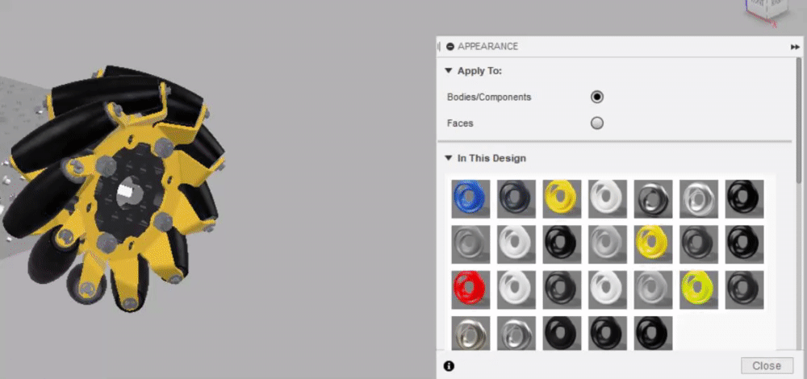
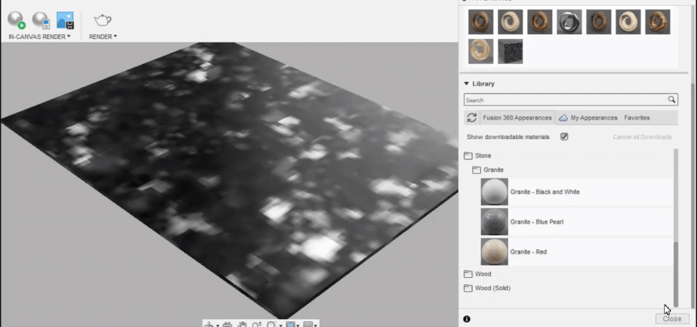
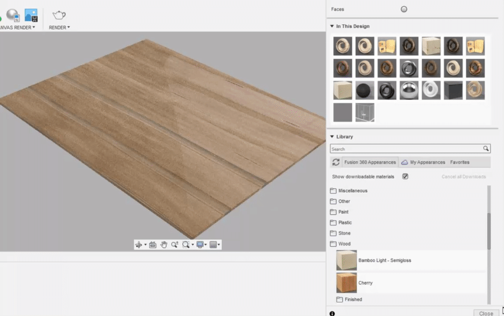
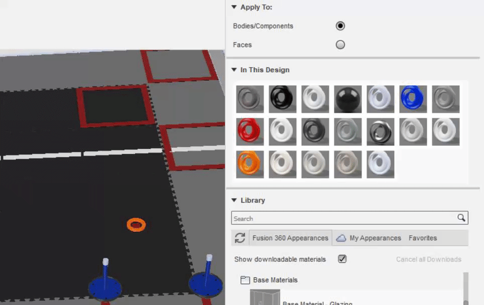
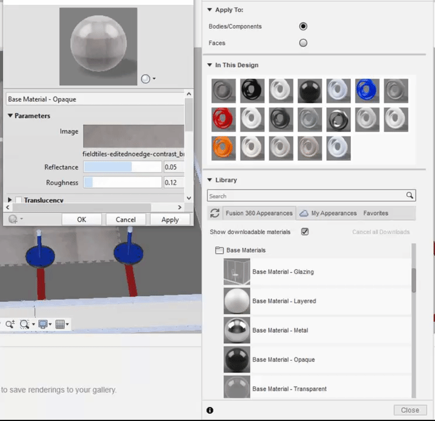
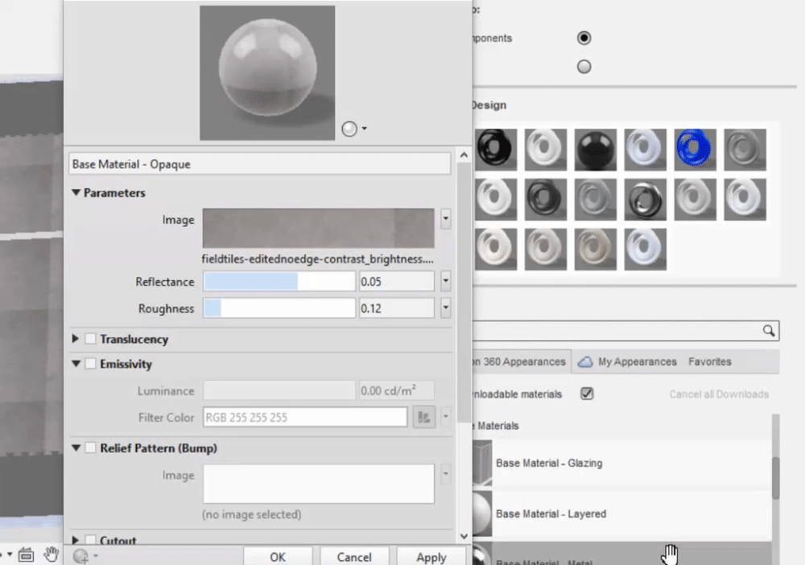
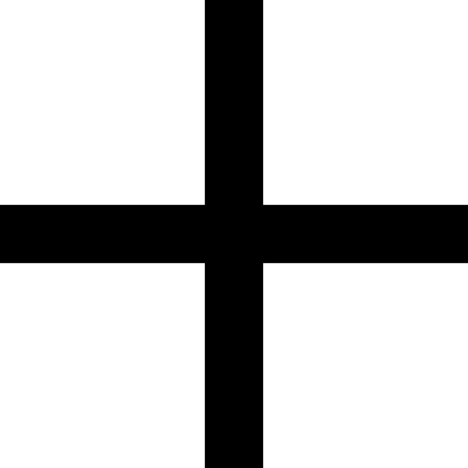
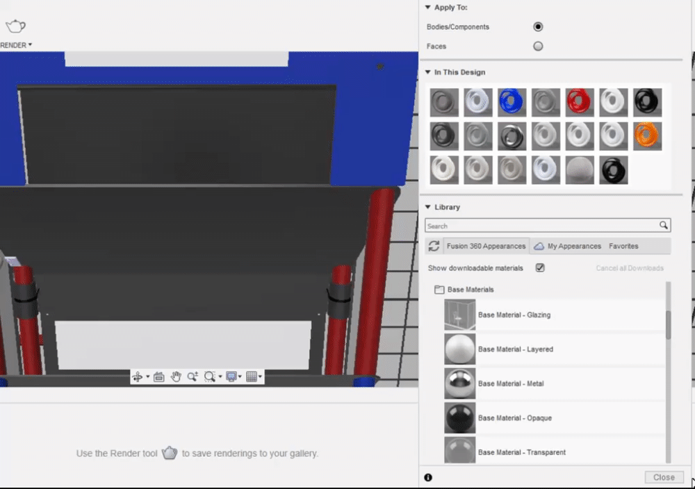
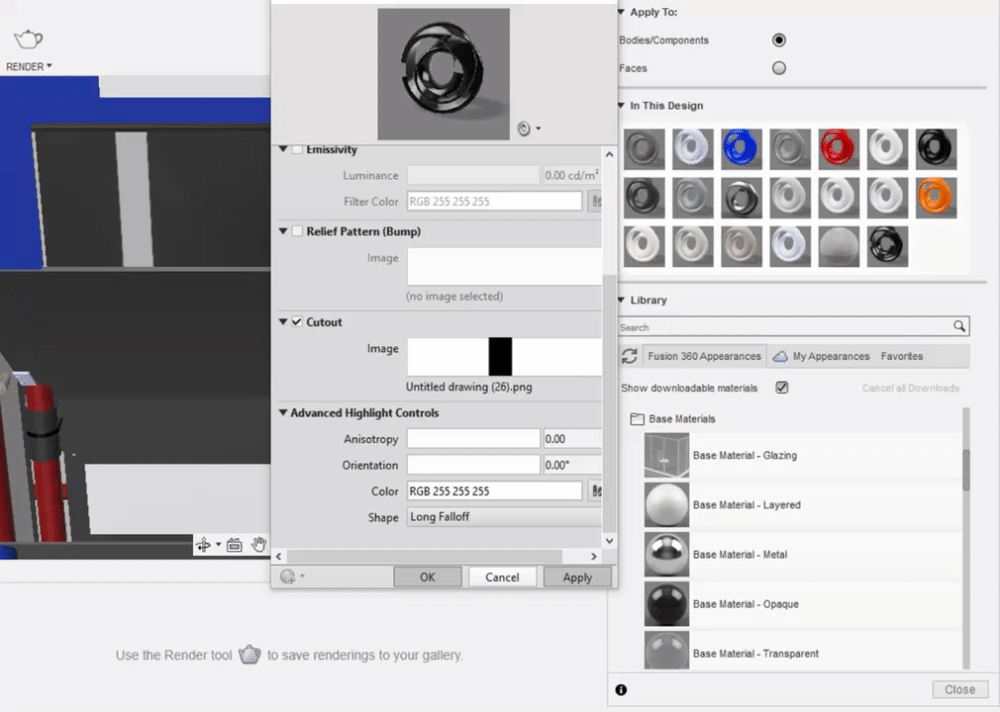

# Making Custom Appearances

## Editing Existing Appearances

In the _Appearances_ tab, we can right-click on an appearance and hit _Edit_ to alter its properties, including color, roughness, and reflectance.

### Changing Roughness

For certain appearances, we can change the roughness to make the part look smoother or rougher \(a higher value means rougher\).

### Changing Reflectance

For certain appearances, we can change the reflectance, which affects the amount of light reflected by the part. The higher the value, the more reflective and shiny it becomes, and vice versa.

### Editing the Scale and Rotation

Many appearances have textures linked with them, that is source images that define part of the look of the appearance. When these appearances are applied, the scale of the source image is often much too large or small to look proper on the object.

In the example below, a granite appearance is edited from the stock scale to a much more reasonable level. In addition, the rotation was changed slightly to slightly change the look of the granite.

### Editing Wood Settings

Unlike many of the other appearances, the solid wood appearances contain a few unique parameters relating to the earlywood, latewood, and rings of the wood appearance.

* Earlywood roughness: controls the roughness of the earlywood \(the lighter wood\)
* Latewood roughness: controls the roughness of the latewood \(the darker rings\)
* Ring thickness: controls the thickness and spacing of rings
* Ring bump: controls the bump of the rings
* Pores/rays: toggles that add extra imperfections to the wood \(recommended to keep on\)

In the example below, these sliders are adjusted to improve upon the current settings and create a wood appearance that more closely matches the desired look.

## Creating New Appearances

While often adjusting existing appearances works well for creating the desired look, there are often times where a completely new appearance would achieve a much better result.

There are three main ways to create a custom appearance: importing the texture source image, importing the bump map source image, and importing the cutout source image. These three aspects will be covered in two examples below.

### Texture Source Image

The texture source image defines how the appearance looks at the base level, much like how the carbon fiber appearance adds the recognizable weave. To achieve the same effect but on a custom appearance, a new source image needs to be added.

In the example below, an FTC field tile image is being used as the texture source image. While this one is provided, taking your own tile source images is encouraged as it will make your tile appearance unique to your team.

To create a custom appearance any appearance can be used, but in this example, the "Base Material - Opaque" appearance will be used as a starting point. To add the field tile image navigate to the advanced editing menu of the appearance and change the color input to an image input.

Already the appearance should be looking pretty close to a tile, but the patterning of the source image looks strange. To fix this, 1 tile of the source image must cover 1 tile, meaning that there is only 1 instance of the image per tile. This is accomplished by clicking on the image in the advanced edit menu and changing the scale to be 25 inches x 25 inches.

While the size of the source image tiles looks correct now, the image tile may not match up with the actual tile body properly. Fixing this issue by manipulating the position of the tiling is covered in [Texture Map Controls](texture-map-controls.md).

### Bump Map

Bump maps are a way of generating a fake normal displacement, that is a displacement of the surface to create dips and bumps. While bump maps do not actually change the geometry of the model \(hence the "fake normal displacement"\), they can give the sensation of displaced geometry.

There are many different and better ways to generate bump maps, for the field tile example, the bump map source image will be exactly the same as the texture image. The same process is followed for importing the image and resizing, only in the bump section of the advanced edit settings.

After applying the bump map, the depth of the bump map can be adjusted to create the desired displacement.


After adding a bump map, and especially for the field tiles, always check and adjust the reflectance and roughness settings.

Field tiles can become oddly shiny after adding a bump map.


### Cutout

Cutout, much like a bump map, creates a fake effect, this time making it appear as if there are holes in the model when in actuality some parts of the model are becoming transparent.

In the example below an appearance that mimics the netting of the FTC Ultimate Goal field will be created using a custom cutout map. Starting with the "Plastic - Glossy \(Black\)" appearance, the cutout image is added and scaled in the advanced section of the appearance edit menu.

The cutout is both much too large and inverted, but these issues can be easily fixed in the cutout image settings menu.


A similar process as the one demonstrated in this example can be used to achieve a wire sleeve appearance.


