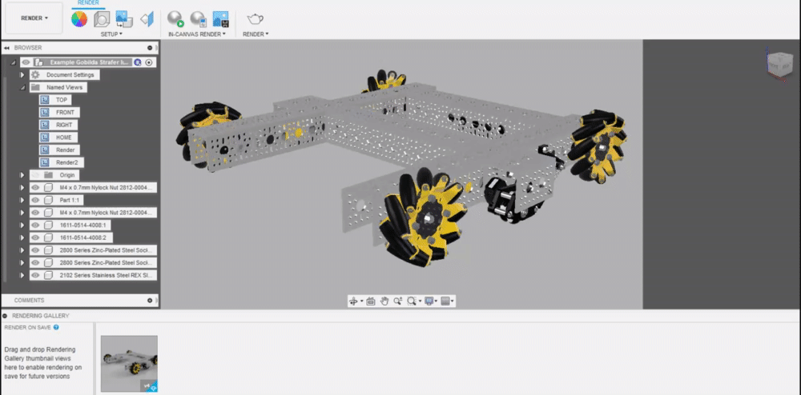
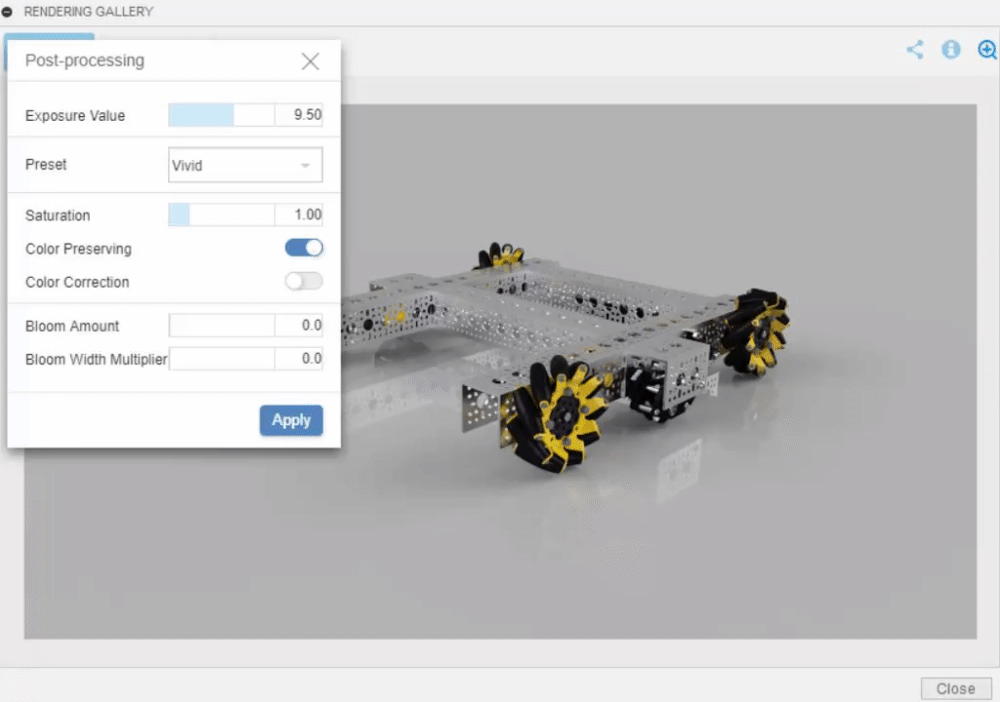
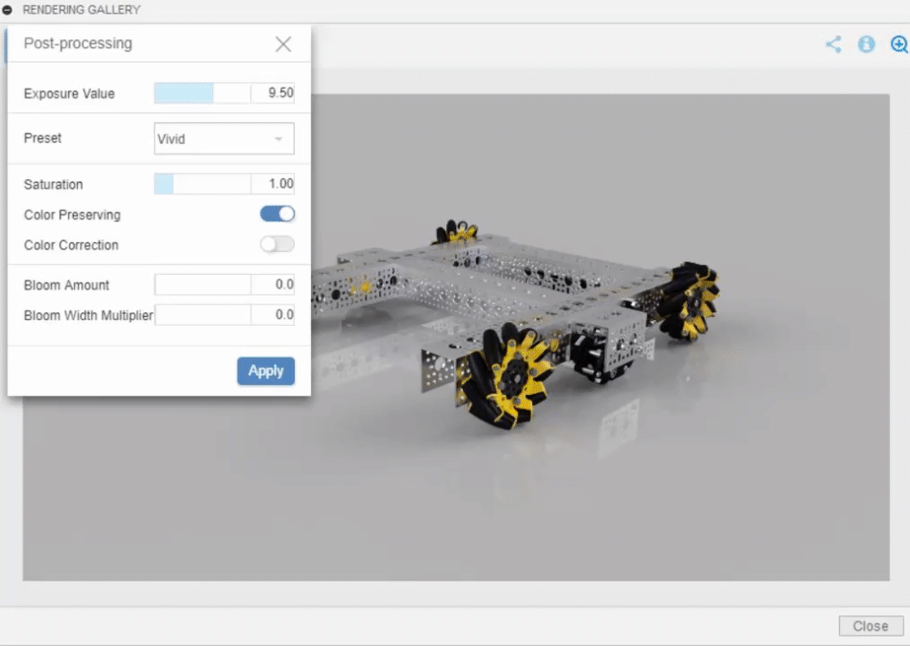

# Post-Processing

If your render's exposure or saturation seems a bit high, or if there are other scene settings that you would like to tweak, Fusion provides an option to easily adjust these without having to redo the entire render.

The post-processing menu is accessed by first opening up the desired render, and then selecting the icon with a plus-sign and a minus-sign.

## Exposure

Exposure is essentially the amount of light in the image, or the relative darkness/lightness of the render. Often renders come out slightly dark, so **decreasing** the exposure value will increase the brightness of the image, and **increasing** the exposure value will decrease the brightness of the image.


Keep in mind that changing the exposure will alter colors \(e.g., the background color will no longer be what it was set to\).

Keep exposure values between 8.5 and 10.5, otherwise it gets extremely washed out out or dark.


## Color Preset

Color presets are built in settings that adjust the highlight compression, contrast, and shadow prominence. While these values can be adjusted manually, there are a few color presets that have fixed values for these settings. Changing these changes the look of the render, but vivid and linear are the best two, with vivid achieving a vibrant look that highlights colors, and linear achieving the most realistic look.

## Saturation

The saturation value controls the intensity of the colors in the render, with a value of 1 not changing anything, values closer to 0 approaching grayscale, and values above 1 increasing the intensity. While changing this is often unnecessary, it can help mute or highlight colors in the render.

## Color Correction

The color correction slider can be used to adjust the white point of the render, or the color temperature of the main light source. Values below 6500 \(default\) will result in a colder-lit image with more blue hues, and values above 6500 will result in a warmer-lit image with more orange hues.

## Bloom

Bloom is used in renders with emissive appearances to control the manifestation of bloom, a post-processing setting that mimics real-world photography of objects emitting a large amount of light.


For there to be any bloom in the render, the bloom amount and bloom width multiplier must be a non-zero value.

For robot renders, a small bloom amount and bloom width will give a more photorealistic look to the emissive materials.


