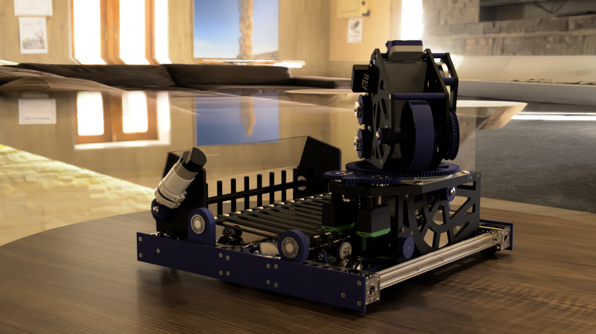

# Ground Plane

A ground plane is the horizontal plane that represents the ground or bottom surface of a space. Ground planes are very useful when rendering because without one, the object in focus appears to be floating \(which may be desired in some instances\). 


A ground plane is not needed if you are using a three-dimensional table or other surface. The table will act as the ground plane, making it unnecessary. If this is the case, uncheck the _Ground Plane_ box. 


### Flatten Ground

The _Flatten Ground_ option _stretches_ out the ground plane by a certain amount. This is dependent on the _Ground Scale,_ which you can adjust by selecting the **Position** icon. Be careful when using this, however. An improperly-scaled ground plane will mess up the HDRI, as seen below.


If you are using a table or other similar surface, make sure that _Flatten Ground_ isn't selected. Unless you know what you're doing, it is highly recommended that you stay away from this. 


### Reflections

The _Reflections_ option allows for the CAD model to be reflected onto the ground plane. How much it is reflected depends on the roughness, which can be any number between 0 and 1. A roughness closer to 0 will result in a more reflective ground plane, while a roughness closer to 1 will result in a less reflective and more rough ground plane.

