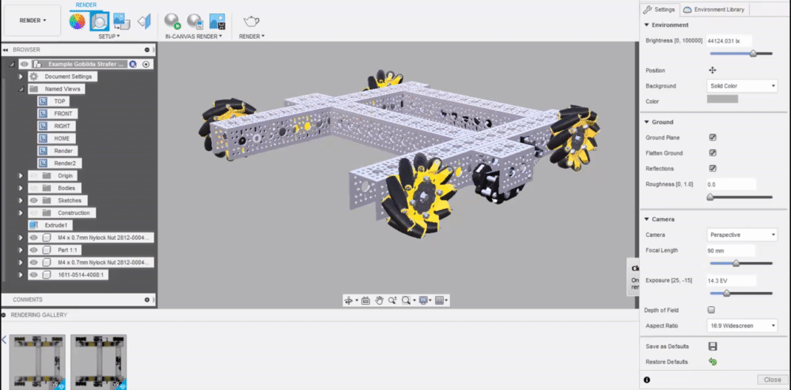
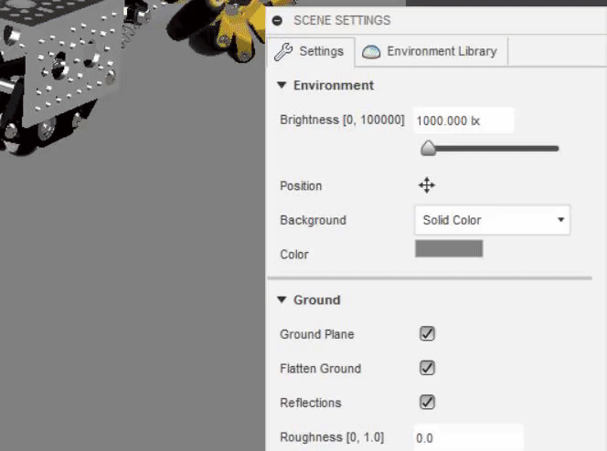
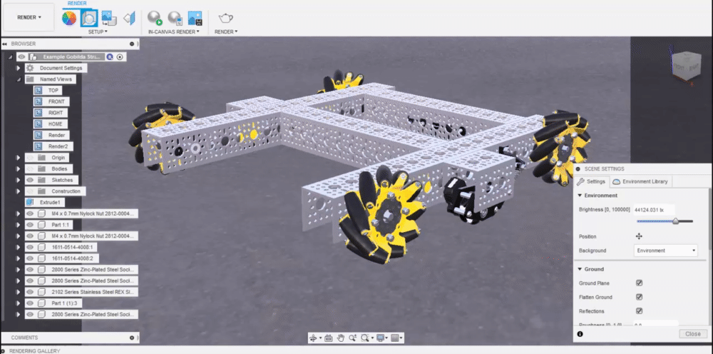

# Background

## Solid Color vs. Environment

Solid color and environment are two options for the background of your render, with solid color making the background a customizable color, and environment setting the background to the selected HDRI \(covered in the HDRI section below\).

You can switch between color background and environment background through the scene settings menu.

### Changing the Background Color

While the default background is a light gray, this can be changed by clicking the on the color palette icon, choosing a new color, and selecting _Apply_.

## HDRIs

HDRIs, or High Dynamic Range Images, are essentially three-dimensional images that contain lighting information in comparison to regular images which simply contain pixels that define the image. They are especially useful in rendering, as it helps create a more realistic scene than solid-colored backgrounds by both introducing realistic lighting data and a realistic background. 

### Using a Built-In HDRI

Fusion 360 comes with a few built-in HDRIs which can serve as decent backgrounds and lighting data for your render. To switch the HDRI being utilized, navigate to _Scene Settings_ and then select the _Environment Library_ tab. From here there are a list of built-in HDRIs.

To apply the HDRI, all you have to do is either drag the environment into the scene or double-click it.

### Using a Custom HDRI

Searching for HDRIs is a bit more complicated than searching for regular images online. Moreover, most of the ones on the internet are not free to use. Fortunately, there are sites such as [HDRI Haven](http://hdrihaven.com/) that you can download free HDRIs from. You can find a few other sites on the [Other Resources](https://renders360.gitbook.io/ftc-rendering-in-fusion-360/other-resources) page.

Here are some of our favorite HDRIs:

* [HDRIHaven - Aerodynamics Workshop](https://hdrihaven.com/hdri/?c=indoor&h=aerodynamics_workshop)
* [HDRIHaven - Machine Shop 01](https://hdrihaven.com/hdri/?h=machine_shop_01)
* [HDRIHaven - Photo Studio 01](https://hdrihaven.com/hdri/?h=photo_studio_01)
* [HDRIHaven - Bush Restaurant](https://hdrihaven.com/hdri/?h=bush_restaurant)

It is recommended that you download the 4K or 8K versions of the HDRI. However, this may not be necessary if you only plan on using the HDRI for its lighting. 

### Attaching a Custom HDRI

After downloading the HDRI, you must import it into Fusion in order to use it. You can do so by navigating to _Scene_ _Settings_ and then selecting the _Environment Library_. Scroll down and select the folder icon next to the words _Attach Custom Environment_.

To apply the HDRI, all you have to do is either drag the environment into the scene or double-click it.

### Positioning the HDRI environment

After your HDRI is applied, you may want to reposition it. In the _Scene Settings_ tab, there is an option to adjust the environment _position_. Here, you can rotate the entire environment around the pivot point. 

