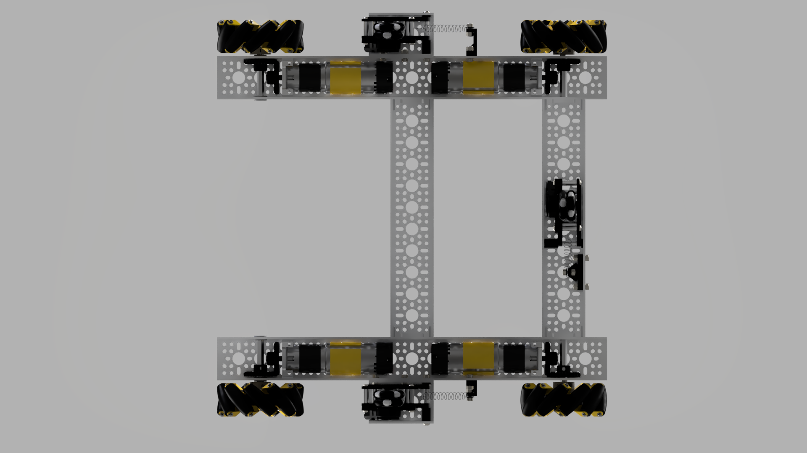

# Perspective vs Orthographic

Perspective and Orthographic are two camera types that define the perspective of objects within the frame.

**TLDR: Use perspective for all isometric renders, use orthographic for orthographically positioned renders.**



Perspective view displays object with realistic depth, making closer objects appear larger, and farther away objects appear smaller. While this gives the correct depth perception of the objects, it strips away any geometric squareness and scaling.




Orthographic preserves 2D geometric properties, keeping angles and relative dimensions instead of distorting parts of the model based on depth. While these is highly undesired for isometric renders of the robot, for orthographic renders of the robot such as the one below, keeping the squares of the robot makes it easier to see the powertrain and odometry in the drivetrain.




